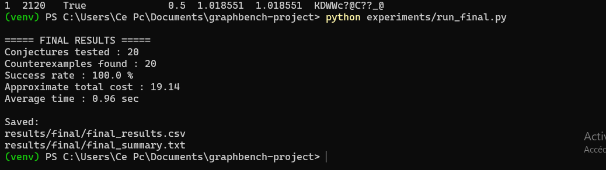

# GraphBench Challenge

Projet de réfutation automatique de conjectures en théorie des graphes.

## Objectif

Le programme génère automatiquement des graphes, calcule leurs invariants, puis cherche des contre-exemples à des conjectures du benchmark.

Un contre-exemple est trouvé lorsque la violation de la conjecture est strictement positive.

---

## Structure du projet

```text
graphbench-project/
├── benchmark/
│   └── benchmark.xlsx
├── experiments/
│   ├── run_basic_search.py
│   ├── run_baseline_search.py
│   ├── run_targeted_search.py
│   └── run_final.py
├── results/
│   ├── basic_search/
│   ├── baseline_search/
│   ├── targeted_search/
│   └── final/
├── src/
│   ├── conjecture.py
│   ├── generator.py
│   ├── invariants.py
│   ├── mutations.py
│   ├── search.py
│   ├── search_baseline.py
│   └── scoring.py
├── requirements.txt
└── README.md
```

---

## Installation

Créer et activer un environnement virtuel :

```powershell
python -m venv venv
.\venv\Scripts\Activate.ps1
```

Installer les dépendances :

```powershell
pip install -r requirements.txt
```

---

## Lancer la recherche baseline

```powershell
python experiments/run_baseline_search.py
```

Cette expérience effectue une recherche évolutionnaire classique basée directement sur la violation réelle des conjectures.

Les résultats sont sauvegardés dans :

```text
results/baseline_search/
```

---

## Lancer la recherche ciblée

```powershell
python experiments/run_targeted_search.py
```

Cette expérience cible spécifiquement les conjectures les plus difficiles restant non résolues après la baseline.

Les résultats sont sauvegardés dans :

```text
results/targeted_search/
```

---

## Fusionner les meilleurs résultats

```powershell
python experiments/run_final.py
```

Cette étape fusionne automatiquement :
- les meilleurs résultats baseline,
- les meilleurs résultats ciblés,

afin de produire les résultats finaux du projet.

Les résultats finaux sont sauvegardés dans :

```text
results/final/
```

---

## Résultat final obtenu

Le système a finalement réussi à trouver :

```text
20 / 20 contre-exemples trouvés
```

avec :

```text
Success rate : 100 %
```

Résultat final obtenu :

```text
Approximate total cost : 19.14
Average time : 0.96 sec
```

---

## Capture du résultat final




---

## Méthode utilisée

Le programme utilise une recherche heuristique évolutionnaire avec :

- population de graphes candidats,
- génération aléatoire de graphes,
- mutations locales,
- sélection des meilleurs graphes,
- redémarrages multiples,
- sauvegarde des graphes trouvés au format graph6.

---

## Mutations disponibles

Les mutations incluent :

- ajout d’arête,
- suppression d’arête,
- ajout de sommet,
- suppression de sommet,
- ajout de feuille,
- subdivision d’arête,
- ajout de chemin,
- ajout de clique,
- ajout de faux jumeau,
- densification locale.

---

## Invariants calculés

Le programme calcule notamment :

- nombre de sommets,
- nombre d’arêtes,
- degré minimum,
- degré maximum,
- degré moyen,
- diamètre,
- rayon,
- nombre de triangles,
- clique maximum,
- nombre d’indépendance,
- couverture par sommets,
- couplage maximum,
- domination,
- domination indépendante,
- domination totale,
- connectivité par sommets,
- connectivité par arêtes.

---

## Validité des graphes

Le programme vérifie automatiquement les classes de graphes suivantes :

- graphes connexes,
- arbres,
- graphes bipartis,
- graphes planaires,
- graphes sans griffe.

---

## Expériences réalisées

### 1. Baseline search

Recherche évolutionnaire classique basée directement sur :

```text
violation = conjecture.violation(invariants)
```

Cette approche a fourni les meilleurs résultats globaux.

---

### 2. Heuristic scoring inspired by FunSearch

Une approche inspirée de FunSearch a également été testée dans :

```text
src/scoring.py
```

Le principe était d’ajouter :
- des bonus heuristiques,
- des critères structurels,
- des scores hybrides.

Cependant, les résultats se sont révélés moins stables que la baseline classique.

Cette comparaison sera utilisée dans le rapport pour discuter :
- des limites des heuristiques génératives,
- de la robustesse de l’optimisation directe,
- et de l’intérêt des approches hybrides.

---

## Format des résultats

Chaque contre-exemple sauvegarde :

- l’identifiant de la conjecture,
- le score de violation,
- le temps de recherche,
- le coût approximatif,
- le graphe au format graph6,
- les invariants calculés.

---

## Technologies utilisées

- Python
- NetworkX
- Pandas
- OpenPyXL

---
